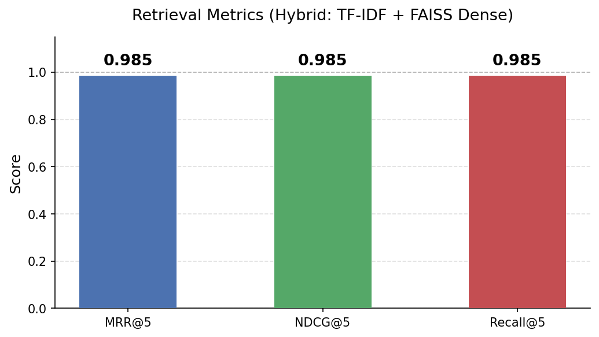
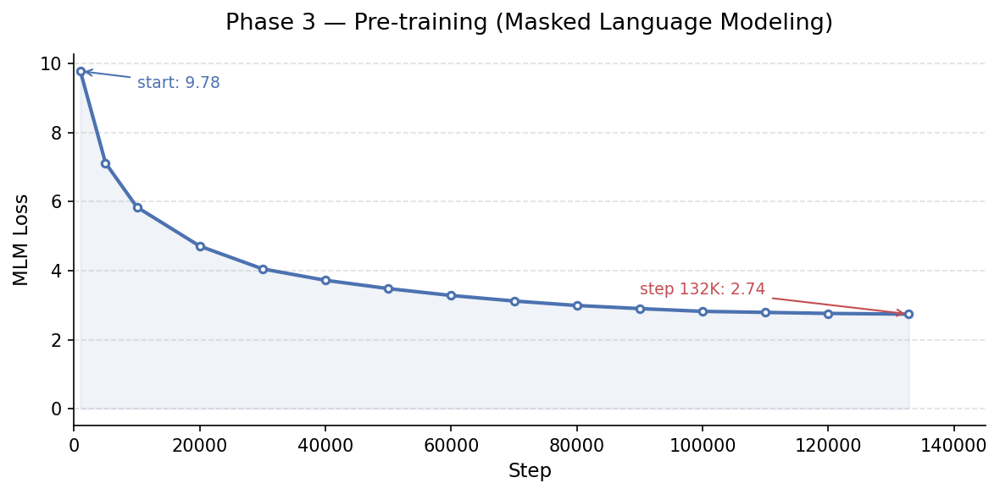
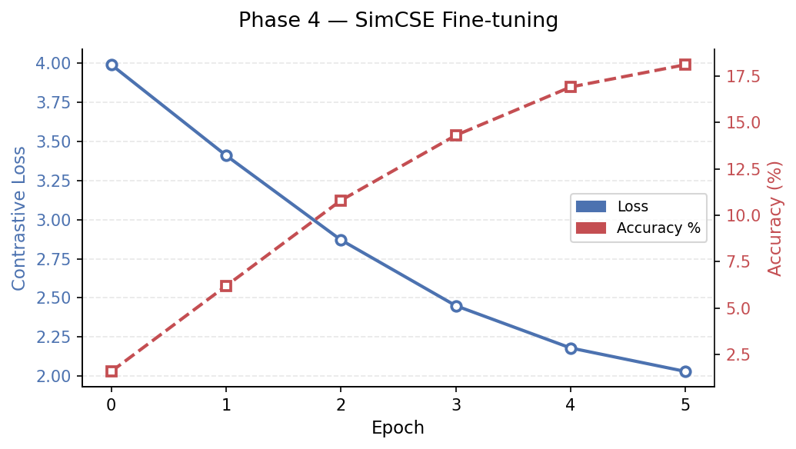
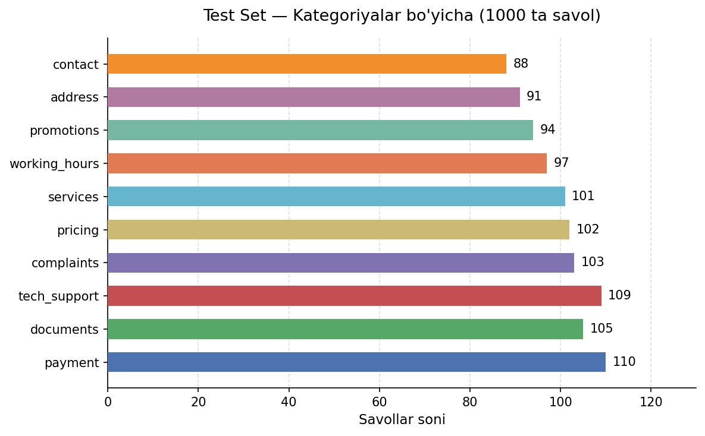

# Uzbek Operator RAG From Scratch

Operator chatbot uchun noldan qurilgan RAG (Retrieval-Augmented Generation) tizimi. Foydalanuvchi `.txt` formatdagi biznes faylini yuklaydi, tizim savollariga javob beradi.

**Hech qanday framework ishlatilmagan** — LangChain, LlamaIndex yo'q. Barcha komponentlar qo'lda yozilgan.

## Arxitektura

```
                    +------------------+
  .txt fayl ------> |  Smart Chunker   | ----> Chunks
                    +------------------+
                            |
              +-------------+-------------+
              |                           |
     +--------v--------+       +---------v--------+
     |  TF-IDF Sparse  |       |  FAISS Dense     |
     |  (ngram 1-2)    |       |  (512-dim embed)  |
     +---------+-------+       +---------+--------+
               |                         |
               +----------+--------------+
                          |
                   Score Fusion (0.5 + 0.5)
                          |
                 +--------v---------+
                 | Confidence Check  |
                 | threshold = 0.20  |
                 +--------+---------+
                          |
              +-----------+-----------+
              |                       |
        score >= 0.20           score < 0.20
              |                       |
     +--------v--------+    +--------v--------+
     | Qwen2.5-7B      |    |   Fallback      |
     | Instruct (8-bit) |    |   "Ma'lumot     |
     +------------------+    |    topilmadi"   |
                             +-----------------+
```

## Komponentlar

| Komponent | Texnologiya | Parametrlar |
|-----------|-------------|-------------|
| Encoder | BERT-style Transformer | 42.1M params, 8 layers, 512 hidden, 8 heads |
| Tokenizer | BPE (tokenizers kutubxonasi) | 16,000 vocab |
| Pre-training | Masked Language Modeling | Wikipedia + BookCorpus, fp16, AdamW |
| Fine-tuning | SimCSE (contrastive learning) | in-batch negatives, temp=0.05 |
| Sparse retrieval | TF-IDF | ngram(1,2), sublinear_tf |
| Dense retrieval | FAISS IndexFlatIP | 512-dim embeddings |
| Hybrid fusion | Score fusion | sparse 0.5 + dense 0.5 |
| Generator | Qwen2.5-7B-Instruct | 8-bit quantization (bitsandbytes) |
| UI | Gradio Blocks | File upload + chat interface |

## Natijalar

### Retrieval (1015 ta test savol, 10 kategoriya)

| Metrika | Qiymat |
|---------|--------|
| MRR@5 | **0.985** |
| NDCG@5 | **0.985** |
| Recall@5 | **0.985** |



### Training Curves

| Bosqich | Metrika | Qiymat |
|---------|---------|--------|
| Pre-training (MLM) | Loss | 9.78 → 2.74 (132K step) |
| SimCSE fine-tuning | Loss | 3.99 → 2.03 (5 epoch) |
| SimCSE fine-tuning | Accuracy | 18.1% (random baseline 1.6%) |





### Test Set Taqsimoti



### Confidence (threshold = 0.20)

| Savol turi | Natija |
|------------|--------|
| Valid savollar (1000 ta) | score ≥ 0.20 → javob beradi |
| Off-domain ("Do you sell airplanes?") | score 0.179 → fallback |
| Off-domain ("Capital of France?") | score 0.171 → fallback |

## Loyiha tuzilmasi

```
.
├── configs/
│   └── config.yaml              # barcha hyperparametrlar
├── data/
│   ├── download_corpus.py       # Wikipedia + BookCorpus yuklab olish
│   ├── preprocess.py            # tozalash, chunklash, shard qilish
│   ├── synthetic_qa_generator.py # 1015 ta test QA juftlik
│   └── sample_operator.txt      # UzTelecom namuna fayl
├── tokenizer/
│   └── train_tokenizer.py       # BPE 16K vocab tokenizer
├── model/
│   ├── attention.py             # Multi-Head Self-Attention
│   ├── transformer.py           # TransformerEncoder (8 layer)
│   ├── mlm_head.py              # MLM boshi + MLMModel
│   └── pooling.py               # Mean/CLS pooling + EmbeddingModel
├── training/
│   ├── pretrain.py              # MLM pre-training loop
│   ├── finetune_simcse.py       # SimCSE contrastive fine-tuning
│   └── merge_checkpoints.py     # 3 shard checkpointlarni birlashtirish
├── retriever/
│   ├── chunker.py               # smart chunker (key_value/list/paragraph)
│   ├── tfidf_retriever.py       # TF-IDF sparse retrieval
│   ├── dense_retriever.py       # FAISS dense retrieval
│   └── hybrid_retriever.py      # score fusion hybrid
├── rag/
│   ├── confidence.py            # confidence threshold + fallback
│   ├── generator.py             # Qwen2.5-7B-Instruct (8-bit)
│   └── pipeline.py              # RAGPipeline: load -> ask -> answer
├── eval/
│   └── evaluate.py              # MRR, NDCG, Recall, Fallback metrics
├── ui/
│   └── app.py                   # Gradio interfeys
├── notebooks/
│   ├── pretrain_kaggle.ipynb     # Phase 3 Kaggle notebook
│   └── finetune_simcse_kaggle.ipynb # Phase 4 Kaggle notebook
├── requirements.txt
└── README.md
```

## O'rnatish

```bash
python3 -m venv venv
source venv/bin/activate
pip install -r requirements.txt
```

## Ishga tushirish

### Phase 1 — Ma'lumotlar tayyorlash

```bash
python data/download_corpus.py --max-docs 200000
python data/preprocess.py
python tokenizer/train_tokenizer.py
python data/synthetic_qa_generator.py
```

### Phase 2 — Model arxitekturasi

`model/` papkasida tayyor. `configs/config.yaml` dan parametrlarni o'qiydi.

### Phase 3 — Pre-training (Kaggle T4 x2)

```bash
python training/pretrain.py --shard-id 0
python training/pretrain.py --shard-id 1
python training/pretrain.py --shard-id 2
python training/merge_checkpoints.py \
    --checkpoints shard0.pt shard1.pt shard2.pt \
    --output checkpoints/pretrain/merged_model.pt
```

| Parametr | Qiymat |
|----------|--------|
| Batch size | 32 |
| Learning rate | 1e-4 |
| Warmup | 10,000 steps |
| Max steps | 500,000 |
| MLM probability | 15% |
| Precision | fp16 |
| Optimizer | AdamW (weight_decay=0.01) |
| Scheduler | cosine decay |

### Phase 4 — SimCSE Fine-tuning

```bash
python training/finetune_simcse.py
```

| Parametr | Qiymat |
|----------|--------|
| Batch size | 64 |
| Learning rate | 3e-5 |
| Epochs | 5 |
| Temperature | 0.05 |
| Loss | contrastive (in-batch negatives) |

### Phase 5 — Evaluation

```bash
python eval/evaluate.py \
    --knowledge data/sample_operator.txt \
    --qa-data data/synthetic_qa.json \
    --output eval/results.json
```

### Phase 6 — UI

```bash
python ui/app.py --knowledge data/sample_operator.txt
```

Gradio interfeys `localhost:7860` da ochiladi. `.txt` fayl yuklang va savol bering.

## Kaggle Notebook

Kaggle T4 x2 da ishga tushirish uchun `notebooks/` papkasidagi notebooklardan foydalaning:

1. `pretrain_kaggle.ipynb` — Phase 3 (MLM pre-training, 12 soat)
2. `finetune_simcse_kaggle.ipynb` — Phase 4 (SimCSE, 174 sekund)

Har bir notebook o'z ichida `git clone` + setup + training qiladi.

## Konfiguratsiya

Barcha parametrlar `configs/config.yaml` da:

```yaml
retriever:
  sparse_weight: 0.5
  dense_weight: 0.5
  top_k: 3
  confidence_threshold: 0.20

generator:
  model_name: "Qwen/Qwen2.5-7B-Instruct"
  max_new_tokens: 256
  temperature: 0.1
  load_in_8bit: true
```

## Qoidalar

- LangChain, LlamaIndex **ishlatilmagan**
- Barcha asosiy komponentlar noldan yozilgan
- Kaggle T4 x2 uchun optimizatsiya qilingan
- Faqat generator uchun tayyor model (Qwen2.5-7B) ishlatilgan
